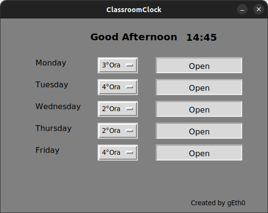

# Classroom-Clock

## Simple Python application for organize your online lessons
</img>
## How to use:
- clone this repository or download the zip file
- Install all depencies needed by typing:
```python
    pip install -r requirements.txt
```
- Then simply run the python file by typing : 
```python
python3 classroom-clock.py
```
or 
```python
python classroom-clock.py
```
## Found a bug or an issue?
Report it on the issue tab up here

#### gEth0